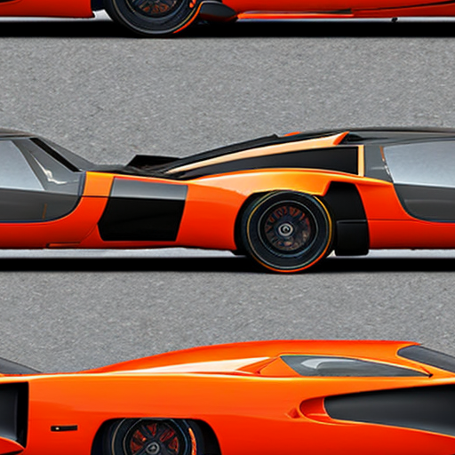
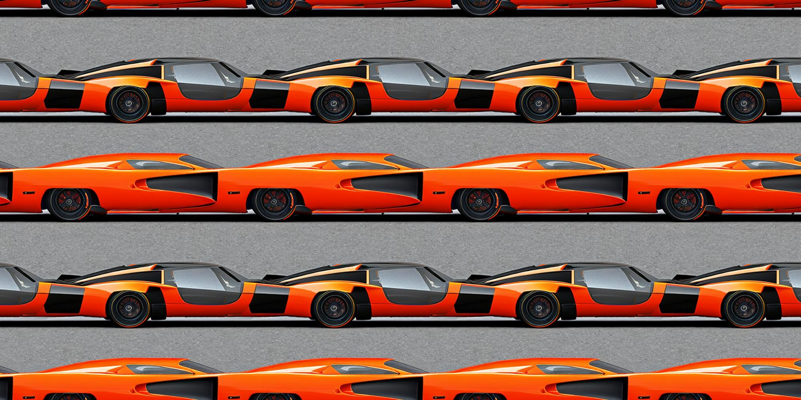
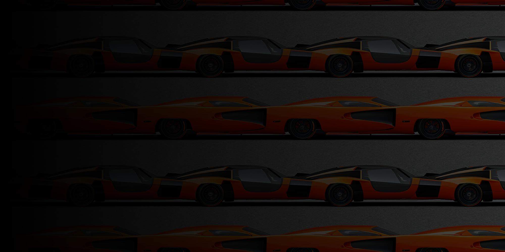
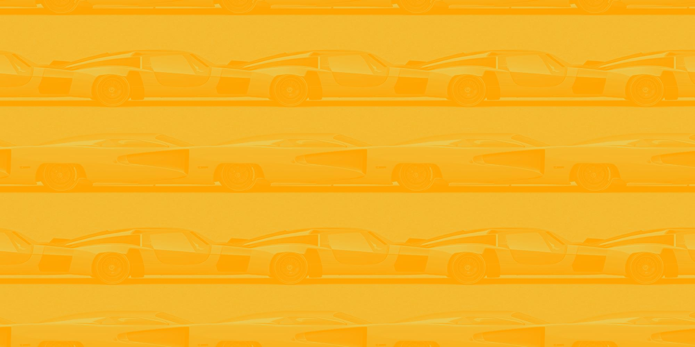

# Mosaic

This program allows to stitch a titling image into a large file, forming large canvas of repetitive patterns.

## Extra functionality

### Dimming an image

A dimming of a given strength can be applied to the image using 7 different options:

1. Uniformed
2. Left-to-right
3. Right-to-left
4. Top-to-bottom
5. Bottom-to-top
6. Left bottom corner to right top corner
7. Left top corner to right bottom corner

### Making colorized greyscale

An image can be turned into a greyscale of predefined colors

## Example

```shell
mosaic.py --source "/tmp/tiles/cars.png" --width 2000 --height 1000 --dim 0.3 --dimming_direction left_to_right --log err
```

### Tiling image



### Mosaic (stitched image)



### Mosaic (stitched and dimmed image)



### Mosaic (stitched and colorized image)

